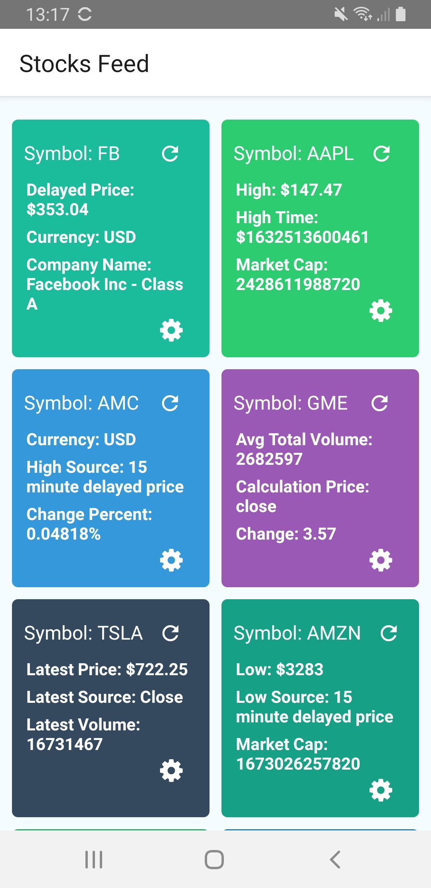

# Easy Stocks

[](https://github.com/BrianJVarley/easy-stocks/actions/workflows/android-build.yml)


> Stocks digest app connected to IEX Cloud API. Using the latest
React Native version and React Native Elements. Work in progress..

This project is forked from react-native-base.



### [Quickstart Guide](./guides/QUICK_START.md)
> The above link gives you a quick start guide on how to run the app in development environment.

## Commands

1. **Start the app**: `yarn android:{env}` or `yarn ios:{env}` (envs: `dev`, `staging`, and `prod`)
2. **Start metro bundler**: `yarn start`
3. **Lint the app**: `yarn lint`
4. **Test the app**: `yarn test`

## Getting started

1. Install dependencies: `yarn`
2. Create a `.env` file in the root directory of the project, based on the `.env.defaults` sample file and the extra constants that you may need. This will be your development env. You can also create `.env.prod` and `.env.staging` to define environment variables for production and staging.

3. Rename your new project using [react-native-rename](https://github.com/junedomingo/react-native-rename). You will also need to rename other files manually.
>Look for `develop` and `staging`'s schemes and `{BuildTarged}-Info.plist`s. You will also need to look for the following patterns inside your project files: `ReactNativeBase`, `react-native-base`, `reactnativebase`, `RNBase`.
Replace them to your corresponding project name (following each corresponding naming convention).
**Important**
When looking for the patterns remember to have the `matching case` option enabled and remember to also check for these patterns in your file names.

4. Start on android or ios: `yarn android:{env}` or `yarn ios:{env}` (envs: `dev`, `staging`, and `prod`)

If you don't want to make use of the Android Flavors and iOS Build Targets then you can run these commands instead:

**For develop**

```
yarn run android:dev
```

**For other envs**

```
ENVFILE=.env.{env} react-native run-ios
```

### Steps for Android development

1. Run the following command inside the `android/app` directory

```
keytool -genkey -v -keystore debug.keystore -storepass android -alias androiddebugkey -keypass android -keyalg RSA -keysize 2048 -validity 10000
```

### Steps for iOS development

1. Run the following command inside the `ios` directory

```
pod install
```

## Continuous Integration

The repo includes configuration for using GitHub Actions to run unit tests and code analysis: `.github/workflows/test.yml`. This can be adapted as needed for specifics of each project. Both CodeClimate and Sonarqube integrations are included in the workflow and their required environment settings should be retrieved from the repo Secrets.


## Bump the app version

We have a nifty script that bumps the app version for you!

If it's your first time using it please check that the `rnbv.config.js` is correctly configured, if in doubt you can refer to the [original file](https://github.com/rootstrap/react-native-base/blob/master/rnbv.config.js) at the `react-native-base` repo.
The iosPaths should match the envs of your repo. This should have already been changed in the rename project steps.

To run the script use the following command:

```
yarn bump
```

You should see something as follows:


Follow the instructions in the prompt to select the version bump that you want and press enter to run it.

As a result you should see something like this (example is minor bump):


## Build Android Release

### Configuration

1. Make sure that the version was already bumped if it applies. You might want to check the [bump the app version](#bump-the-app-version) section
2. Ask a developer for the release key and place it in `/android/app`
3. Add the following variables in `.env.prod`:

```
 RELEASE_STORE_FILE
 RELEASE_STORE_PASSWORD
 RELEASE_KEY_ALIAS
 RELEASE_KEY_PASSWORD
```

### Create release

> The following guide explains how the CI deploy and publish is configured for the app.

1. Commit and Merge pull request to main branch.
2. Run `yarn np` to create a Github release.
3. The Github actions pipeline automatically handle deploying the app to Google Play Store (`./github/workflows/`) when a new release has be created on the Github repo.
## Build iOS Release

1. Make sure that the version was already bumped if it applies. You might want to check the [bump the app version](#bump-the-app-version) section
2. Select on Xcode the scheme of the build target you want to create the release for.
3. For the device select **generic iOS device**.
4. Then go to **Product** -> **Archive**.
5. After it is done processing and the archive succeeds the **organizer** will open. Here is where you can see all the previously generated archives.

## Managing multiple environments

The base is already equipped with three main environments: `dev`, `staging`, `production`. All the env files you need to provide are as follows: `.env`, `.env.staging`, and `.env.prod`.

If you want to add a new env here are the steps to follow:

1. Create a new env file with the format `.env.{name}`.

### Android

2. go to `android/app/build.gradle` and add the env file association to `project.ext.envConfigFiles` following the existing ones as example.
3. Scroll down to the `flavors` section and add a new flavor with the following format:

```
{name} {
  applicationIdSuffix '.{name}'
  minSdkVersion rootProject.ext.minSdkVersion
  targetSdkVersion rootProject.ext.targetSdkVersion
}
```

4. Inside `android/app/src` copy one of the existing env folders like `staging` and rename it with the name of your new flavor.
5. In that new folder you will see a folder called `values` and inside a file called `strings.xml` there you can set the app name that is going to appear for this flavor. You can also set special app icons for each flavor inside `res` folder.
6. (optional) go ahead and add new scripts in the `package.json` file for this new env. As you can see, the other envs already have scripts to run, build and build release, this will make your development workflow a lot easier.
7. you might need to open the android folder in Android Studio and do **File** -> **Sync project with grade files**

#### Manually set the env file

If you are looking for something quick and easy in the short term, there is one more way you can run the app with a custom env file, just run:

```
  ENVFILE=.env.{env} react-native run-android
```

### iOS

#### Using different build targets

You can use build targets to configure different app-icons, splash, bundle-ids, etc.

Build targets are a great way to manage multiple envs in TestFlight. When you have staging and production builds that need testing by the client in TestFlight and you are not using build target this can become a bit of an issue.

Fortunately the base already comes with the build targets you will probably need to get to production: `ReactNativeBase-Develop`, `ReactNativeBase-Staging` and `ReactNativeBase` which is for production use.

Each build target has its respective scheme already set up, they all have the same name as the build target except for the production one, that one is called `ReactNativeBase-Prod`. This leaves `ReactNativeBase` scheme free of an env setup just in case you don't want to use build targets.

To add a new build target do as follows:

2. Open XCode and go to the project settings, there you should see a list of the already created targets.
3. Right click in the `ReactNativeBase` build target (or your app's name if you have already renamed it) and select duplicate.
4. Select duplicate only.
5. Rename the new build target appropriately.
6. At the root of the `ios` folder a new copy of the info.plist file will be created. You also need to rename that file appropriately.
7. Since you have renamed the new build target's info.plist file, you need to go to the **Build Settings** of the new build target and in **Packaging** rewire the info.plist File attribute with the file's new name.
8. A new scheme will also be created, rename it appropriately.
9. Go to edit the scheme and in the left side bar select **Build** -> **Pre-actions**. Select the plus button and **New run script action**. In the code section of the action put as follows: `echo ".env.{name}" > /tmp/envfile` where name is the name of the env you created.
10. Add the new build target to your pod file:

```
target '{TargetName}' do
  base_pods


  use_native_modules!
end
```

11. (optional) If you are using Fastlane, copy Fastlane's config from one of the other build targets and rename in the appropriate places, the files you need to look into are `ios/Fastfile` and `ios/Appfile`.

- `Staging` and `Develop` targets search for `.env.staging` and `.env` automatically (if the file it's not present, it will raise a build error).

- `npm run ios:staging` and `npm run ios:develop` are available if you want to run the targets from the CLI.

#### Using schemas

If you don't want to use Build Targets, you have the option to just create new schemes for the base build target.

Create a new scheme and follow the step number **9** and **11** of **Using different build targets**.

#### Manually set the env file

If you are looking for something quick and easy in the short term, there is one more way you can run the app with a custom env file, just run:

```
  ENVFILE=.env.{env} react-native run-ios
```

## Automation with Fastlane

This project provides configuration for automatic build and release using [Fastlane](<(https://fastlane.tools)>).
For more details please check configuration and Readme files for [iOS](./ios/fastlane/README.md) and [Android](android/fastlane/README.md) or [fastlane docs](https://docs.fastlane.tools/getting-started/android/setup/)


  - Every time you run fastlane, use bundle exec fastlane [lane]
  - On your CI, add bundle install as your first build step
  - To update fastlane, just run bundle update fastlane

## Troubleshooting

### iOS not building on Xcode 10

https://github.com/rootstrap/react-native-base/issues/40

## Base dependencies

- [React-Navigation](https://reactnavigation.org)
- [PropTypes](https://github.com/facebook/prop-types)
- [React-Native-Config](https://github.com/luggit/react-native-config)
- [ReactNativeLocalization](https://github.com/stefalda/ReactNativeLocalization)
- [Redux](https://github.com/reduxjs/redux)
- [Redux-Thunk](https://github.com/reduxjs/redux-thunk)
- [Redux-Persist](https://github.com/rt2zz/redux-persist)
- [humps](https://github.com/domchristie/humps)
- [validate.js](https://github.com/ansman/validate.js)
- [immer](https://github.com/immerjs/immer)
- [lodash](https://github.com/lodash/lodash)
- [Jest](https://github.com/facebook/jest)
- [Enzyme](https://github.com/airbnb/enzyme)

### Redux-Persist configuration

The current configuration for redux-persist is on `store/configureStore.js`.

The default configuration is the following:

- There's a defined `whitelist` where all reducers marked to be persisted must be declared.
- The `storage` engine is `AsyncStorage` but you can change it if needed, for example: https://github.com/CodingZeal/redux-persist-sensitive-storage if you need keychain storage on iOS.
- If you ever need to set up migrations to keep your reducers up to date, please check [this link](https://github.com/rt2zz/redux-persist#migrations).

### Typescript

> The following guide provides a detailed run through on how to [convert a react-native app to _TypeScript_](https://medium.com/@patngo/transitioning-a-react-native-app-to-typescript-in-2019-f61c5acb8e1e)

#### Adding missing modules types
> This project was converted to Typescript, in order to sync missing `@types` for these node modules, run the following:

```bash
yarn global add typesync
npx typesync [path/to/package.json] [--dry]

```

Or add unavilable type definitions placeholder to `./custom-types.d.ts` file.


Using Custom react debugger

> The following debugger can be installed and associated env var set to enable
better debugging and netqork request tracking. See: https://github.com/jhen0409/react-native-debugger/blob/master/docs/getting-started.md


```bash
open "rndebugger://set-debugger-loc?host=localhost&port=8081"

```

### TODOS

[todo's list](./todo.md)


### IEX Cloud API

1. Sign up on - https://iexcloud.io/cloud-login?r=https%3A%2F%2Fiexcloud.io%2Fconsole%2F#/
2. Create an api token and add to your CI environment vars.
3. `services/stocksService/` handles servicing the requests to the IEX Cloud API.
4. Requests follow the following format:

```
https: //cloud.iexapis.com/stable/stock/symbol/quote? token = YOUR_KEY`

```

5. Reference projects: https://github.com/diogobh93/IEX-Cloud


